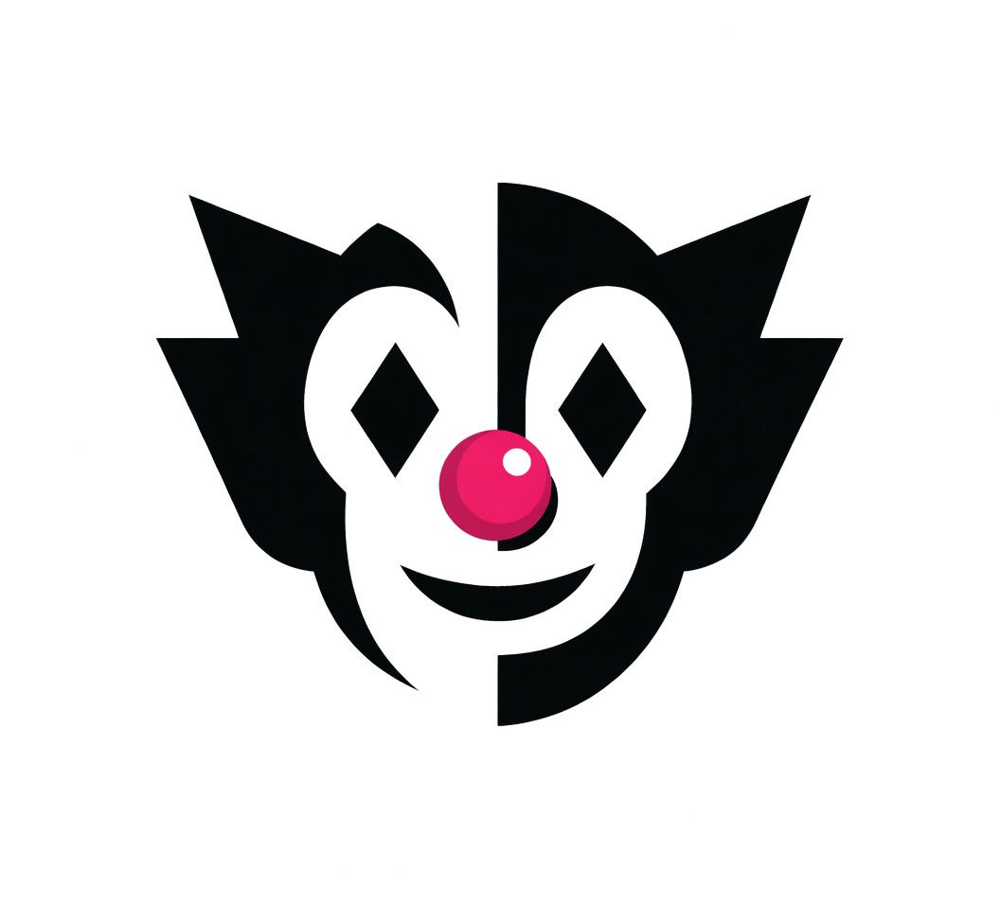

# Ca$hClowns — Free Mouse Jiggler App for Windows

**The mouse jiggler app they don't want you to have.**

Ca$hClowns is a free, lightweight **mouse jiggler app for Windows 10 and Windows 11** that keeps your PC awake, prevents your screen from locking, and maintains your active status on Microsoft Teams, Slack, Zoom, and Webex — with no cloud, no subscriptions, and no monitoring.

---

## 🟢 What It Does

Ca$hClowns simulates small, natural mouse movements at configurable intervals to:

- **Keep your PC awake** — prevents Windows sleep mode and screensaver activation
- **Keep Teams status green** — stays Active/Available on Microsoft Teams
- **Keep Slack status active** — no more "Away" when you step away
- **Prevent screen lock** — no more re-entering your password every 5 minutes
- **Work during presentations** — screen never dims or locks mid-demo
- **Keep downloads running** — overnight transfers complete without interruption

---

## ⚡ Features

| Feature | Ca$hClowns |
|---|---|
| Price | 🆓 Free |
| Internet required | ❌ None |
| Installation required | ❌ None |
| Cloud account | ❌ None |
| Data collection | ❌ Zero |
| Windows 10 support | ✅ Yes |
| Windows 11 support | ✅ Yes |
| Animated clown mascot | 🤡 Obviously |

---

## 📥 Download

**[→ Get Ca$hClowns Free](https://cashclowns.github.io/KeepAlive/#download)**

- No installer — single executable, just run it
- No .NET runtime required
- Works on Windows 10 and Windows 11 (32-bit and 64-bit)
- No admin rights needed

---

## 🚀 How It Works

1. Download the Ca$hClowns executable
2. Run it — the clown mascot confirms it's active
3. Your mouse moves automatically in the background
4. Your screen stays awake, your status stays green

That's it. No setup. No configuration. No cloud. Just results.

---

## 🎯 Who Uses Ca$hClowns

- **Remote workers** keeping Teams and Slack status active during breaks
- **Work from home employees** preventing screen lock on corporate laptops
- **IT admins and techs** keeping sessions alive during long installs and transfers
- **Presenters** preventing screen dim during demos and meetings
- **Anyone** tired of re-logging in every 10 minutes

---

## 🌐 Links

- 🌍 **Website:** [cashclowns.github.io/KeepAlive](https://cashclowns.github.io/KeepAlive/)
- 📺 **YouTube:** [@cashclownsai](https://www.youtube.com/@cashclownsai)
- 📥 **Download:** [Free Download](https://cashclowns.github.io/KeepAlive/#download)

---

## ❓ FAQ

**Is Ca$hClowns really free?**
Yes. No subscriptions, no premium tier, no credit card. Free forever.

**Does it work on Windows 11?**
Yes. Fully compatible with Windows 10 and Windows 11.

**Does it need internet?**
No. Ca$hClowns runs 100% offline. Nothing leaves your machine.

**Will it keep my Microsoft Teams status green?**
Yes. The mouse movement prevents the idle detection that causes Teams to show Away.

**Does it require installation?**
No. Single portable executable. Just download and run.

---

*Stay Green. Stay Paid.* 🤡
